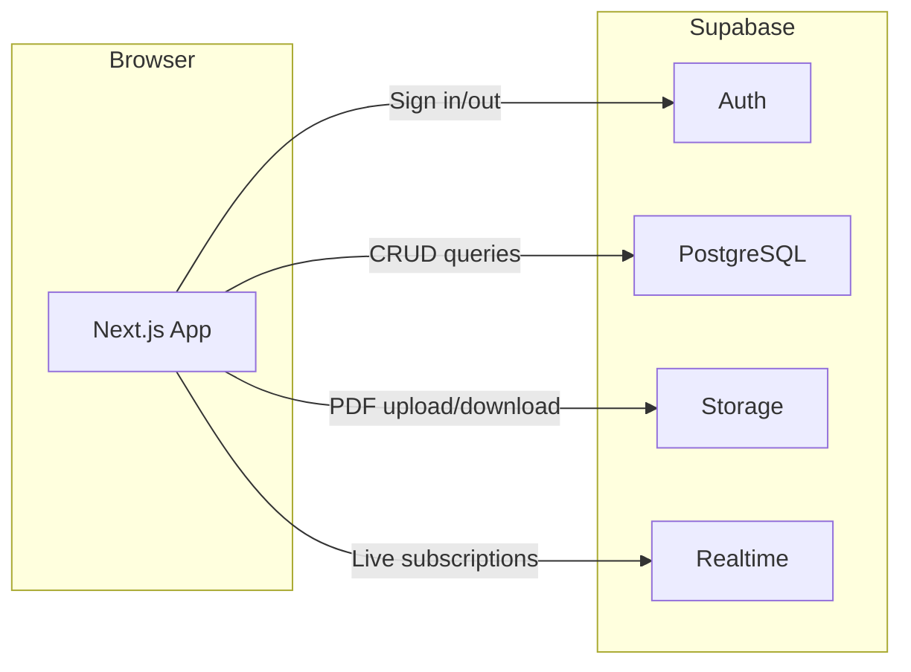
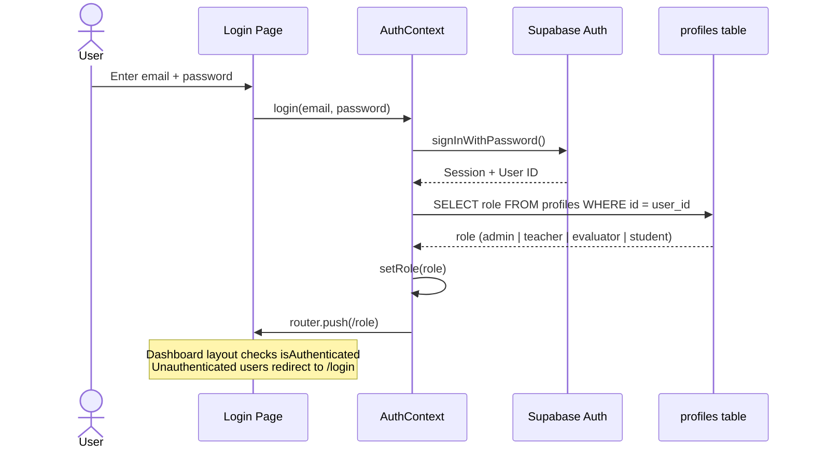
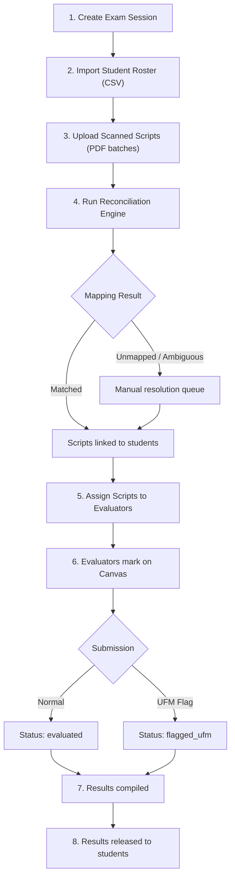
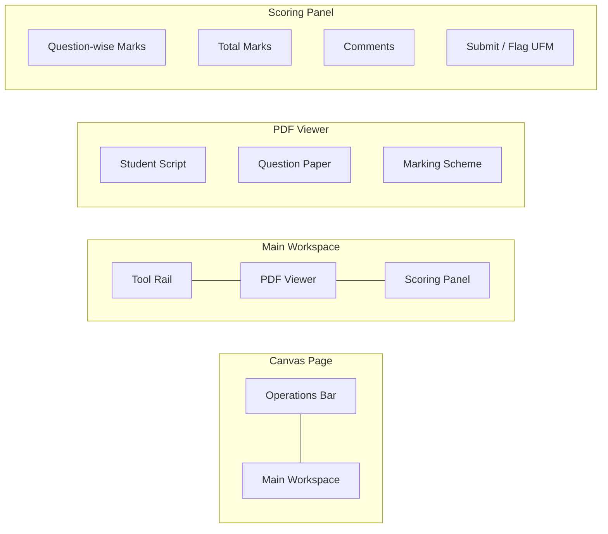
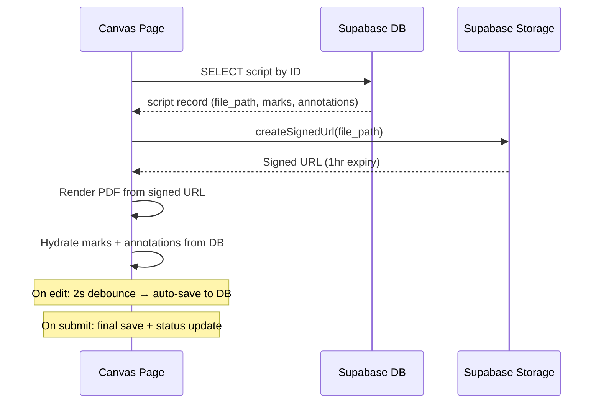

# Architecture

## System Overview

EvalMeridian is a Next.js application that uses Supabase as its backend-as-a-service. There is no separate backend server — the frontend communicates directly with Supabase for authentication, database queries, file storage, and real-time subscriptions.



## Authentication Flow



## Role-Based Routing

```mermaid
flowchart TD
    A[User visits /] --> B{Authenticated?}
    B -->|No| C[/login]
    B -->|Yes| D{Role from profiles}

    D -->|admin| E[/admin]
    D -->|evaluator| F[/evaluator]
    D -->|teacher| G[/teacher]
    D -->|student| H[/student]

    E --> E1[Overview]
    E --> E2[Operations]
    E --> E3[Scripts]
    E --> E4[Students]
    E --> E5[Results]
    E --> E6[Assign]

    F --> F1[Script Queue]
    F --> F2["/evaluator/canvas/[id]"]

    G --> G1[Overview]
    G --> G2[Resources]
    G --> G3[Results]

    H --> H1[Overview]
    H --> H2[Results]
```

## Exam Evaluation Workflow

This is the core operational flow managed by the admin:



## Evaluator Canvas Architecture

The canvas is the most complex component. It runs as a full-screen workspace with the sidebar hidden.



Key implementation details:
- PDF rendering uses `react-pdf` with `pdfjs-dist`, loaded via `next/dynamic` (no SSR)
- Annotations are stored as a JSON array in the `scripts.annotations` column
- Auto-save uses a 2-second debounce after any marks/annotations/comments change
- Split view uses `react-resizable-panels` for adjustable pane widths
- Documents are loaded via Supabase Storage signed URLs (1-hour expiry)

## Data Flow: Script Loading



## Real-Time Subscriptions

The operations page uses Supabase Realtime to listen for changes to the `scripts` table:

```typescript
supabase
  .channel(`session-${sessionId}-scripts`)
  .on('postgres_changes', {
    event: '*',
    schema: 'public',
    table: 'scripts',
    filter: `exam_session_id=eq.${sessionId}`
  }, () => fetchUnmapped())
  .subscribe();
```

This means the admin's monitoring panel updates automatically when evaluators submit marks, without polling.
